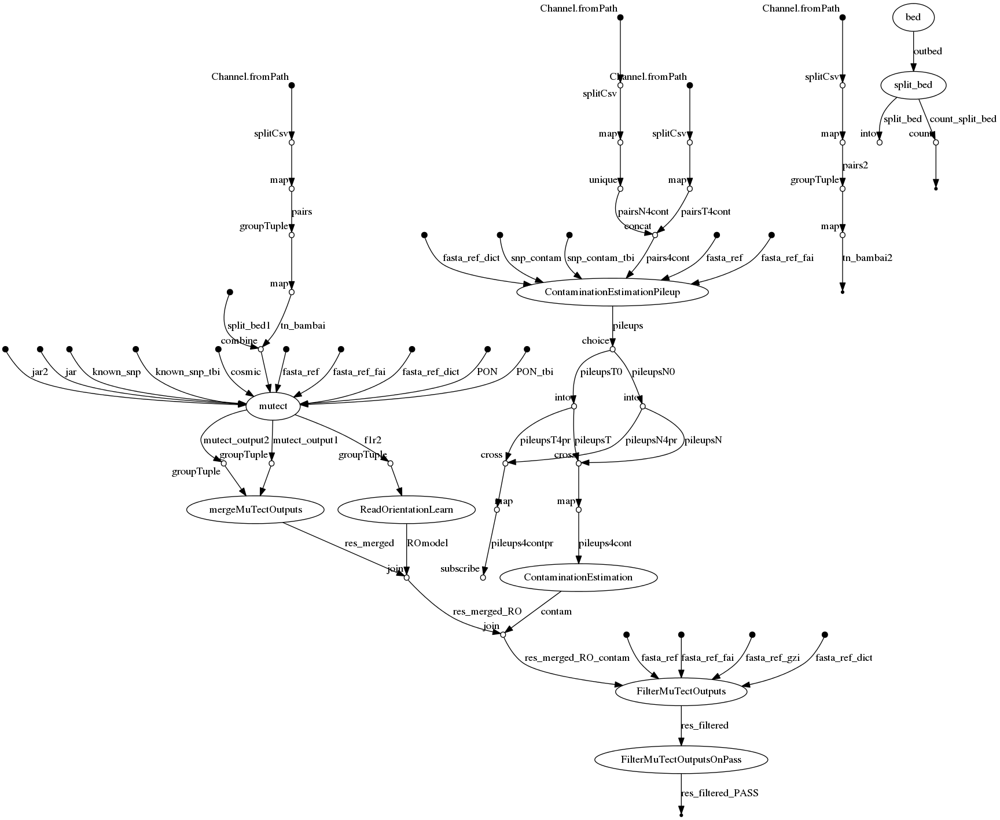

# mutect-nf


## Mutect pipeline for somatic variant calling with Nextflow
[](https://circleci.com/gh/IARCbioinfo/mutect-nf/tree/master)
[](https://hub.docker.com/r/iarcbioinfo/mutect-nf/)
[](https://singularity-hub.org/collections/4357)


## Description
Nextflow pipeline for somatic variant calling with mutect with Mutect2, gatk4

## Dependencies
1. Nextflow: for common installation procedures see the [IARC-nf](https://github.com/IARCbioinfo/IARC-nf) repository.
2. [gatk4](https://github.com/broadinstitute/gatk) that includes Mutect2
3. [bedtools](http://bedtools.readthedocs.io/en/latest/content/installation.html) and move the executable file in your path.
4. [python](https://www.python.org/) and package [pysam](https://github.com/pysam-developers/pysam)
5. [bedops](https://github.com/bedops/bedops)

**A conda receipe, and docker and singularity containers are available with all the tools needed to run the pipeline (see "Usage")**

### GATK4
With GATK4, a list of known_snps can be provided to mutect2 to improve the variant classification, for example file [af-only-gnomad.hg38.vcf.gz](https://console.cloud.google.com/storage/browser/_details/gatk-best-practices/somatic-hg38/af-only-gnomad.hg38.vcf.gz) from the bundle best practices from the broad institute [GATK somatic calling bundle](https://console.cloud.google.com/storage/browser/gatk-best-practices/somatic-hg38/).


## Input
 
| Name           | Description |
|:---------------|-------------|
|--tn_file       | input tabulation-separated values file with columns sample (sample name), tumor (full path to tumor bam), normal (full path to matched normal bam); |

The method uses a tabulation-separated values format file with columns sample, tumor, and normal (in any order); When the genotype mode is active, additional columns are expected: preproc, specifying if preprocessing of RNA-seq bam file is required (yes or no) and vcf, indicating the location of the vcf file containing the alleles to genotype. Preproc includes splitting spanning reads, correcting CIGAR string with NDN pattern, and changing mapping quality of uniquely mapped reads from 255 to 60(gatk4's splitNCigarReads and a custom python script). The tn_file method is necessary for joint multi-sample calling, in which case the sample name is used to group files, and to specify preprocessing of some RNA-seq samples.

eg :

| sample               | normal              | Tumor               |
|----------------------|---------------------|---------------------|
| sampleA_vs_normalA   | path/to/normalA.bam | path/to/sampleA.bam |
| sampleB_vs_normalB   | path/to/normalB.bam | path/to/sampleB.bam | 

optionally (for --genotype mode), columns preproc (is the bam RNAseq needing preprocessing: yes or no) and vcf (full path to vcf file containing alleles to genotype)

| sample               | normal              | Tumor               | preproc | vcf                   |
|----------------------|---------------------|---------------------|---------|-----------------------|
| sampleA_vs_normalA   | path/to/normalA.bam | path/to/sampleA.bam | yes     | /path/to/allelesA.vcf |
| sampleB_vs_normalB   | path/to/normalB.bam | path/to/sampleB.bam | no      | /path/to/allelesB.vcf |

**BAI indexes have to be present in the same location than their BAM mates, with the extension `bam.bai`.**

## Reference & Interval

Reference (--ref) is the fasta file used for creation of bam files.
Intervals (--bed) is a file defining the regions to call, in the format region (CHR:START-END) or bed (CHR START END).
If no file is provided, the calling will be performed on whole genome, based on the faidx file.'

| Name | Default value | Description                   |
|------|---------------|-------------------------------|
|--ref | ref.fa        | reference genome fasta file   |
|--bed |               | Bed file containing intervals | 

## Optional options for Mutect2

| Name         | Default value | Description |
|--------------|---------------|-------------| 
|--cpu         | 4 | number of CPUs          |
|--mem         | 8 | memory for mapping      |
|--nsplit      | 1 | Split the region for calling in nsplit pieces and run in parallel |
|--known_snp   |   | VCF file with known variants and frequency (e.g., from gnomad) |
|--PON         |   | path to panel of normal VCF file used to filter calls |
|--mutect_args |   | Arguments you want to pass to mutect. WARNING: form is " --force_alleles " with spaces between quotes |

## filter readorientation

| Name                    | Description |
|-------------------------|-------------| 
|--filter_readorientation | Run extra step learning read orientation model and using it to filter reads |

## estimate contamination
When a list of known snps is provided, run extra step of estimating contamination by normal and using the results to filter calls. We recommend the file [small_exac_common_3.hg38.vcf.gz](https://console.cloud.google.com/storage/browser/_details/gatk-best-practices/somatic-hg38/small_exac_common_3.hg38.vcf.gz) from the best practices broad institute bundle.

| Name         | Default value | Description |
|--------------|---------------|-------------| 
|--snp_contam  |               | VCF file with known germline variants to genotype for contamination estimation |

## Output 

| Name           | Description |
|----------------|-------------|
|--output_folder | mutect_results | output folder for aligned BAMs|

The output_folder directory contains two subfolders: stats and intermediate_calls
| Type      | Description   |
|-----------|---------------|
| sample.vcf.gz and sample.vcf.gz.tbi   | filtered VCF files and their indexes |
| stats/    | gatk stats files from mutect |
| intermediate_calls/raw_calls/sample.vcf | unfiltered VCF files |

## Usage
To run the pipeline on a series of matched tumor normal files described in a tabular input file (--tn_pair), a reference genome with indexes *ref*, and a bed file ref.bed, one can type:
```bash
nextflow run IARCbioinfo/mutect-nf -r DSL2 -profile singularity  --tn_pair pair.tsv --ref ref_genome.fa --bed ref.bed
``` 
To run the pipeline without singularity just remove "-profile singularity". Alternatively, one can run the pipeline using a docker container (-profile docker), apptainer (-profile apptainer) or the conda receipe containing all required dependencies (-profile conda).

To follow GATK best practices, use --PON --filter_readorientation and --snp_contam
```bash
nextflow run IARCbioinfo/mutect-nf -r DSL2 -profile singularity  --tn_pair pair.tsv --ref ref_genome.fa --bed ref.bed --PON pon.vcf.gz --filter_readorientation --snp_contam contam.vcf.gz
``` 

### Genotypages

| Name           | Description |
|----------------|-------------|
|--genotype      | use genotyping from vcf mode instead of usual variant calling requires tn_file with vcf column and gatk4, and if RNA-seq included, requires preproc column |

| Name         | Default value | Description |
|--------------|---------------|-------------| 
|--ref_RNA     |               | fasta reference for preprocessing RNA (required when preproc column contains yes in input tn_file) |


#### Help section
You can print the help manual by providing `--help` in the execution command line:

| Name  | Description |
|-------|-------------| 
|--help | print usage and optional parameters |

```bash
nextflow run iarcbioinfo/mutect-nf --help
```
This shows details about optional and mandatory parameters provided by the user.  


## FAQ
### Why are some samples absent from the output vcfs when I run multi-sample calling?
Outputs are based on the SM field of the BAM file; when multiple files have the same SM, only one is outputed.

### Why are some samples present in the input file ignored?
Check that the input is tab-separated. When parsing the input file, if a line is not tab separated, nextflow will ignore it without returning an error.

## Directed Acyclic Graph
[](http://htmlpreview.github.io/?https://github.com/IARCbioinfo/mutect-nf/blob/dev/dag.html)

## Contributions

  | Name      | Email | Description     |
  |-----------|---------------|-----------------| 
  | Nicolas Alcala*    | AlcalaN@iarc.fr    | Developer to contact for support |
  | Tiffany Delhomme   |                    | Developer |
  | Vincent Cahais     |                    | Developer |
